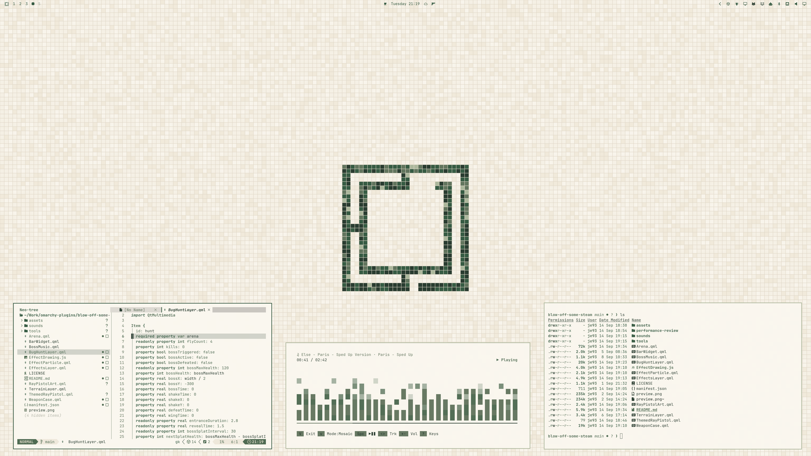
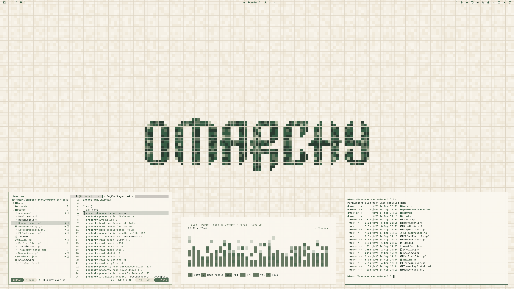

# Green Mosaic

A light theme for Omarchy with warm beige mosaic tiles, forest-green motifs, and a matching interface palette.





## Install

For **Omarchy 4 with Omarchy Shell**:

```sh
omarchy theme install https://github.com/ejuro/omarchy-green-mosaic-theme
```

## The theme

- A continuous mosaic floor with two Omarchy motifs: logo and wordmark.
- A transparent top bar that blends into the tiled background.
- Solid, warm ivory windows and menus with green accents and sage borders.
- A forest-green terminal palette and Adwaita icons.

## Wallpapers

Two **3840 × 2160** wallpapers are included.

[Logo](backgrounds/01-green-mosaic-logo-4k.png) · [Wordmark](backgrounds/02-green-mosaic-wordmark-4k.png)

## License

[MIT](LICENSE) · [Omarchy artwork attribution](THIRD_PARTY_NOTICES.md)
